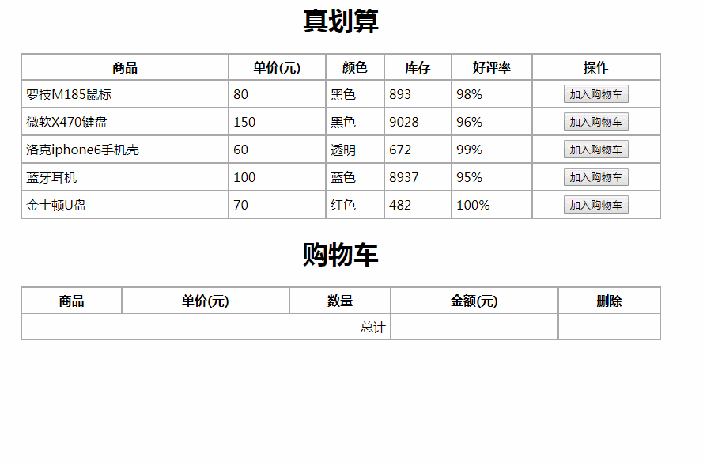

# 原生js实现购物车逻辑ShoppingCart2

效果如下：
fdsfdsf


all code:
```
<!doctype html>
<html lang="en">
<head>
    <meta charset="UTF-8">
    <title>原生js购物车</title>
    <style>
        h1{text-align:center;}
        table{margin:0 auto;width:60%;border:2px solid #aaa;
            border-collapse:collapse;}
        table th, table td {
            border:2px solid #aaa;
            padding:5px;
        }
    </style>
</head>
<body>
<h1>真划算</h1>
<table>
    <tr>
        <th>商品</th>
        <th>单价(元)</th>
        <th>颜色</th>
        <th>库存</th>
        <th>好评率</th>
        <th>操作</th>
    </tr>
    <tr>
        <td>罗技M185鼠标</td>
        <td>80</td>
        <td>黑色</td>
        <td>893</td>
        <td>98%</td>
        <td align="center">
            <input type="button" value="加入购物车" onclick="add_shoppingcart(this);"/>
        </td>
    </tr>
    <tr>
        <td>微软X470键盘</td>
        <td>150</td>
        <td>黑色</td>
        <td>9028</td>
        <td>96%</td>
        <td align="center">
            <input type="button" value="加入购物车" onclick="add_shoppingcart(this);"/>
        </td>
    </tr>
    <tr>
        <td>洛克iphone6手机壳</td>
        <td>60</td>
        <td>透明</td>
        <td>672</td>
        <td>99%</td>
        <td align="center">
            <input type="button" value="加入购物车" onclick="add_shoppingcart(this);"/>
        </td>
    </tr>
    <tr>
        <td>蓝牙耳机</td>
        <td>100</td>
        <td>蓝色</td>
        <td>8937</td>
        <td>95%</td>
        <td align="center">
            <input type="button" value="加入购物车" onclick="add_shoppingcart(this);"/>
        </td>
    </tr>
    <tr>
        <td>金士顿U盘</td>
        <td>70</td>
        <td>红色</td>
        <td>482</td>
        <td>100%</td>
        <td align="center">
            <input type="button" value="加入购物车" onclick="add_shoppingcart(this);"/>
        </td>
    </tr>
</table>

<h1>购物车</h1>
<table>
    <thead>
    <tr>
        <th>商品</th>
        <th>单价(元)</th>
        <th>数量</th>
        <th>金额(元)</th>
        <th>删除</th>
    </tr>
    </thead>
    <tbody id="goods">
    <!--
    <tr>
      <td>罗技M185鼠标</td>
      <td>80</td>
      <td align="center">
        <input type="button" value="-"/>
        <input type="text" size="3" readonly value="1"/>
        <input type="button" value="+"/>
      </td>
      <td>80</td>
      <td align="center"><input type="button" value="x" onclick="delete();"/></td>
    </tr>
    -->
    </tbody>
    <tfoot>
    <tr>
        <td colspan="3" align="right">总计</td>
        <td id="total"></td>
        <td></td>
    </tr>
    </tfoot>
</table>
</body>
</html>
<script>
    function add_shoppingcart(btn) {

        var tr = btn.parentNode.parentNode;
        var tds = tr.getElementsByTagName("td");
        var name = tds[0].innerHTML;
        var price = tds[1].innerHTML;

        var tbody = document.getElementById("goods");
        var row = tbody.insertRow();
        row.innerHTML =
                '<td>'+name+'</td>'+
                '<td>'+price+'</td>'+
                '<td align="center">'+
                '<input type="button" value="-" onclick="change(this, -1);"/> '+
                '<input type="text" size="3" readonly value="1"/> '+
                '<input type="button" value="+" onclick="change(this, 1);"/> '+
                '</td>'+
                '<td>'+price+'</td>'+
                '<td align="center"><input type="button" value="x" onclick="del(this);"/></td>';
        total();
    }

    function del(btn) {
        var tr = btn.parentNode.parentNode;
        tr.parentNode.removeChild(tr);
        total();
    }

    function change(btn, n) {
        var inputs = btn.parentNode.getElementsByTagName("input");
        var amount = parseInt(inputs[1].value);
        if(amount<=1 && n<0) {
            return;
        }

        inputs[1].value = amount + n;
        amount = inputs[1].value;

        var tr = btn.parentNode.parentNode;
        var tds = tr.getElementsByTagName("td");
        var price = parseFloat(tds[1].innerHTML);
        var m = price*amount;
        tds[3].innerHTML = m;

        total();
    }

    function total() {
        var tbody = document.getElementById("goods");
        var trs = tbody.getElementsByTagName("tr");
        var sum = 0;
        for(var i=0;i<trs.length;i++) {
            var td = trs[i].getElementsByTagName("td");
            var m = td[3].innerHTML;
            sum += parseFloat(m);
        }
        var total = document.getElementById("total");
        total.innerHTML = sum;
    }
</script>
```

